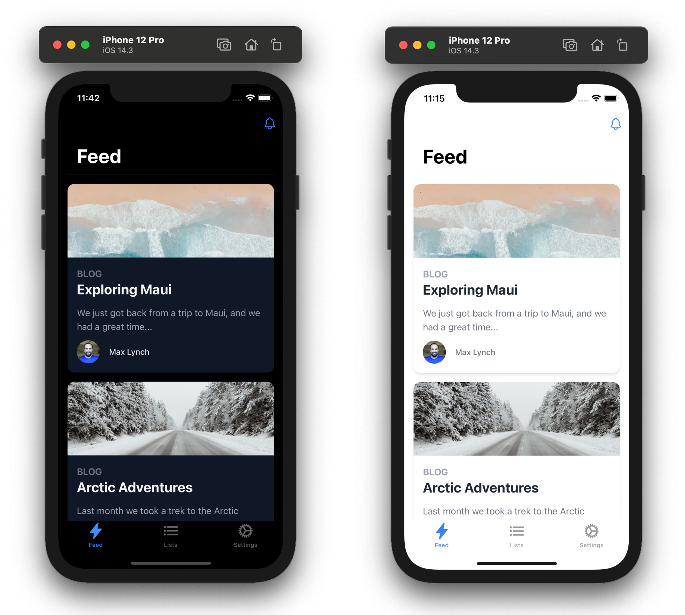

# Next.js + Tailwind CSS + Ionic Framework + Capacitor Mobile Starter



This repo is a conceptual starting point for building an iOS, Android, and Progressive Web App with Next.js, Tailwind CSS, [Ionic Framework](https://ionicframework.com/), and [Capacitor](https://capacitorjs.com/).

Next.js handles the production React app experience, Tailwind can be used to style each page of your app, Ionic Framework provides the cross-platform system controls (navigation/transitions/tabs/etc.), and then Capacitor bundles all of it up and runs it on iOS, Android, and Web with full native access.

See this blog post for an overview of the stack and how it all works: <https://dev.to/ionic/build-mobile-apps-with-tailwind-css-next-js-ionic-framework-and-capacitor-3kij>

## Usage

This project is a standard Next.js app, so the typical Next.js development process applies (`npm run dev` for browser-based development). However, there is one caveat: the app must be exported to deploy to iOS and Android, since it must run purely client-side. ([more on Next.js export](https://nextjs.org/docs/advanced-features/static-html-export))

To build the app, run:

```bash
npm run build
```

All the client side files will be sent to the `./out/` directory. These files need to be copied to the native iOS and Android projects, and this is where Capacitor comes in:

```bash
npm run sync
```

Finally, use the following run commands to run the app on each platform:

```bash
npm run ios
npm run android
```

## Livereload/Instant Refresh

To enable Livereload and Instant Refresh during development (when running `npm run dev`), find the IP address of your local interface (ex: `192.168.1.2`) and port your Next.js server is running on, and then set the server url config value to point to it in `capacitor.config.json`:

```json
{
  "server": {
    "url": "http://192.168.1.2:3000"
  }
}
```

Note: this configuration wil be easier in Capacitor 3 which [recently went into beta](https://capacitorjs.com/blog/announcing-capacitor-3-0-beta).

## API Routes

API Routes can be used but some minimal configuration is required. See [this discussion](https://github.com/mlynch/nextjs-tailwind-ionic-capacitor-starter/issues/4#issuecomment-754030049) for more information.

## Caveats

One caveat with this project: Because the app must be able to run purely client-side and use [Next.js's Export command](https://nextjs.org/docs/advanced-features/static-html-export), that means no Server Side Rendering in this code base. There is likely a way to SSR and a fully static Next.js app in tandem but it requires [a Babel plugin](https://github.com/erzr/next-babel-conditional-ssg-ssr) or would involve a more elaborate monorepo setup with code sharing that is out of scope for this project.

Additionally, Next.js routing is not really used much in this app beyond a catch-all route to render the native app shell and engage the Ionic React Router. This is primarily because Next.js routing is not set up to enable native-style transitions and history state management like the kind Ionic uses.

## What is Capacitor?

You can think of [Capacitor](https://capacitorjs.com/) as a sort of "electron for mobile" that runs standard web apps on iOS, Android, Desktop, and Web.

Capacitor provides access to Native APIs and a plugin system for building any native functionality your app needs.

Capacitor apps can also run in the browser as a Progressive Web App with the same code.
