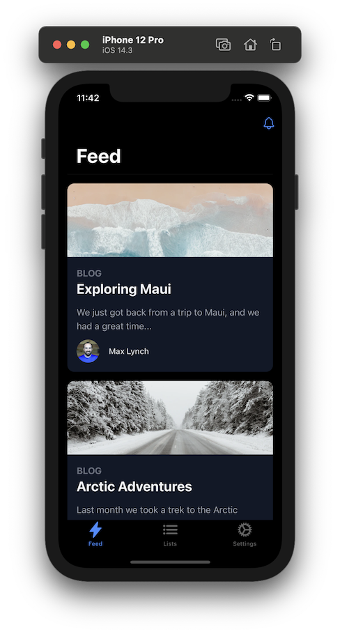

# Next.js + Tailwind CSS + Capacitor for mobile app development

This repo is a starting point for building an iOS, Android, and Progressive Web App with Tailwind CSS, Next.js, and Capacitor. It comes with some pre-built components that can be customized using Tailwind classes, and provides the most important UI controls needed to build native mobile experiences (tabs, nav bars, modals, menus, etc).

These components are baked into the starter and will be adopted into your project. This way you gain full control over the experience and can easily modify the look and feel of the components to match your design.

If you're looking for more of a batteries-included approach where you _don't_ adopt and maintain the components yourself, I recommend [Ionic React](https://ionicframework.com/react).

## What is Capacitor?

You can think of [Capacitor](https://capacitorjs.com/) as a sort of "electron for mobile" that runs standard web apps on iOS, Android, Desktop, and Web.

Capacitor provides access to Native APIs and a plugin system for building any native functionality your app needs.

Capacitor apps can also run in the browser as a Progressive Web App with the same code.

## Progress

There are currently snippets for the following common mobile components:

- [x] App Shell
- [x] Content
- [x] Tabs
- [ ] Nav (in progress)
- [x] Icon
- [x] Menu
- [x] Modal
- [ ] Dialog
- [x] Button
- [x] Card
- [x] Safe Area
